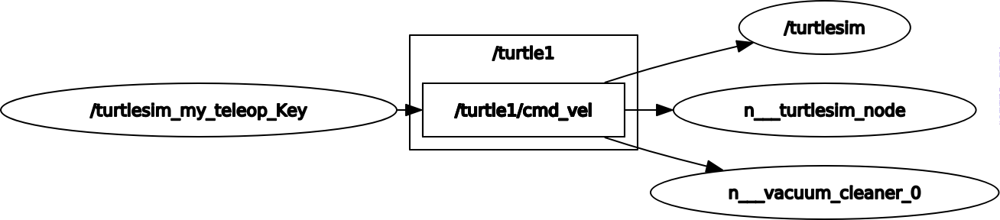
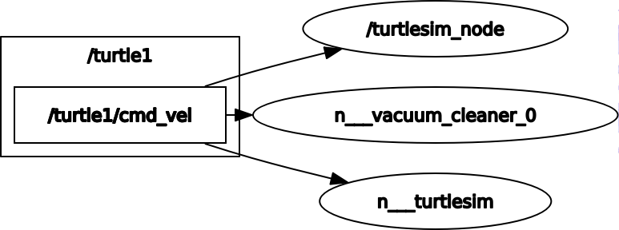
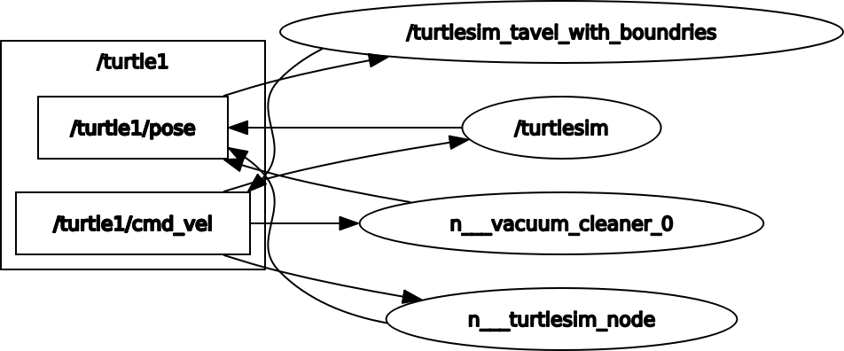
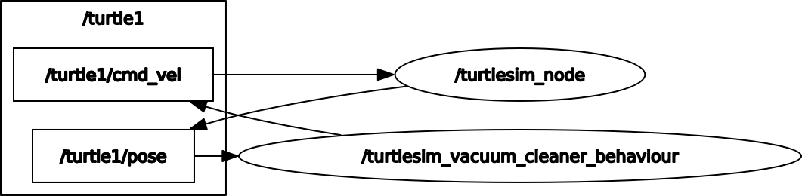
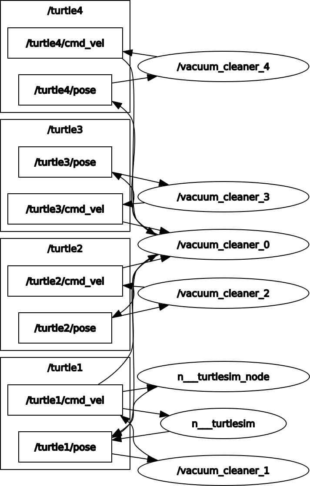

# Turtlesim_My_Controllers_PDE4430_CW1

**Coursework 01 for Mudule: PDE4430 Mobile Robotics 2024-2025**. Tasks to be complete as follows;
1. Teleoperation using the keyboard, with an option to change movement speed  
2. Autonomous navigation to any given coordinate in the Turtlesim window 
3. Avoiding wall collision – Override movement if wall hitting is imminent
4. Vacuum Cleaning behaviour – Covering the entire window in an efficient manner 
5. Multiple turtles vacuum cleaning behaviour   

* **Implementation Language:** Python
* **Python Version:** This project is intended for `Python 3.8.10`, as per the original author's specification.
 

## 1). Task 01 - Teleoperation using the keyboard, with an option to change movement speed  

*Note:* This task involves modifying/recreate the `turtlesim_teleop_key` control script to include a speed control option and keyboard inputs for enhanced control of the turtlesim simulation.

1. **Objective:** Recreate the in-built turtlesim_teleop_key script with added functionalities:
    - Speed Control: Allow dynamic adjustment of the turtle's movement speed.   
    - Enhanced Keyboard Controls: Implement custom keyboard inputs for better control.
2. **Implementation Note:** Developed the task to control the turtlesim bot with keyboard inputs of "WASD" or arrow kes and using "+" or "-", can be control the speed. 
3. **Flow of Information:**
    - Nodes:
        - `my_teleop_cmds`:
        This is the main node created in the script using `rospy.init_node('my_teleop_cmds')`.
        It acts as a controller node, reading keyboard inputs and publishing velocity commands to the robot.
    - Topics :
        - `/turtle1/cmd_vel`:
        A ROS topic where velocity commands (Twist messages) are published. This topic is subscribed to by the Turtlesim bot to control its movement.
    - Messages:
        - `geometry_msgs/Twist`:
        This message type is used to control the robot's linear and angular velocities.
        It contains:
            - `linear.x`: Specifies the forward or backward.
            - `angular.z`: Specifies the rotational velocity (left or right turn).
4. **Information Flow Steps:**
- Initialization:
    - The node `my_teleop_cmds` is initialized.
    - A publisher is created to send Twist messages to the `/turtle1/cmd_vel` topic.
- User Input via Keyboard:
    - The `getKey()` function reads keyboard input in real time.
    - The key pressed is interpreted as a movement command:
        - 'W' or Up Arrow: Move forward.
        - 'S' or Down Arrow: Move backward.
        - 'A' or Left Arrow: Rotate left.
        - 'D' or Right Arrow: Rotate right.
        - '+': Increase speed.
        - '-': Decrease speed.
        - 'R': Reset speed to default.
        - 'Q' or 'P': Quit the program.
- Command Processing:
Depending on the key pressed, the script updates the Twist message:
    - Sets appropriate values for `linear.x` and `angular.z`.
    - Logs the movement and speed to the console.
- Publishing Commands:
    - The Twist message with the updated velocity values is published to the `/turtle1/cmd_vel` topic using `pub.publish(move_cmd)`.
    - This message controls the movement of the Turtlesim robot.
- Speed Control:
    - The user can adjust the speed dynamically using the `'+'` and `'-'` keys.
    - Speed changes are applied to the `linear.x` or    `angular.z` values accordingly.
- Shutdown Behavior:
    - If the node is shut down (via user input or system termination), the `shutdown_hook()` function stops the robot by publishing a `Twist` message with zero velocities `(linear.x = 0, angular.z = 0)`.

>>**Development Code :** `turtlesim_myteleop_key.py`
>>**Task Running file :** `runTask01.launch`

**<u>Rqt Graph</u>**

 

## 2).Task 02 - Autonomous navigation to any given coordinate in the Turtlesim window 

*Note:* This task indicating to develop a program to move the bot to given cordinates.

1. **Objective:** Bot should navigate the given cordinates from currect position.
2. **Implementation Note:** This task has been developed to move the turtlesim bot to the given target from the currect position. Used Pythagorean theorem to calculate the distance and depend on the distance bot will change the speed (Added a constant value to change the speed). If the target is too far, bot will move faster and if the target is close, bot will move slowly to achive the target cordinates accuratly.
3. **Flow of Information:**
    - Nodes:
        - `turtlebot_target_controller`:
        The main node created using `rospy.init_node`.
        It controls the Turtlesim robot by publishing velocity commands and subscribing to the robot's current pose.
    - Topics :
        - `/turtle1/cmd_vel`:
        A ROS topic where velocity commands are published `(geometry_msgs/Twist)`.
        Controls the robot's movement in terms of linear and angular velocities.
        - `/turtle1/pose`:
        A ROS topic where the robot's current position and orientation are published `(turtlesim/Pose)`.
        Provides feedback about the robot's pose, which is used to compute the distance and angle to the target.
    - Messages:
        - `geometry_msgs/Twist`:
        Used to send velocity commands:
            - `linear.x`: Linear velocity along the x-axis (forward/backward movement).
            - `angular.z`: Angular velocity (rotation around the z-axis).
        - `turtlesim/Pose`:
        Provides the robot's current state:
            - `x`: x-coordinate of the robot.
            - `y`: y-coordinate of the robot.
            - `theta`: Orientation angle of the robot.

4. **Information Flow Steps:**
- Node Initialization:
    - The node turtlebot_target_controller is initialized.
    - A Publisher is created to publish velocity commands to `/turtle1/cmd_vel`.
    - A Subscriber listens to `/turtle1/pose` to update the robot's current position and orientation.
- Pose Update:
    - The subscriber callback update_pose receives messages from `/turtle1/pose`.
    - Updates the global variable pose with the robot's current position and orientation.
    - The `pose.x` and `pose.y` values are rounded to improve accuracy.
- User Input:
    - The user specifies a target `(x, y)` position.
    - Input validation ensures the target is within the Turtlesim window bounds `(0 ≤ x, y ≤ 11)`.
- Distance and Angle Calculation:
    - Distance to Target:
        - The Euclidean distance to the target is calculated using direct_distance`(target_pose)`.
    - Steering Angle:
        - The angle required to face the target is computed using `steering_angle(target_pose)` (using `atan2`).
- Velocity Commands:
        - Linear Velocity:
            - Calculated using `linear_vel(target_pose)`. It scales with the distance to the target but is capped by a constant for safety.
        - Angular Velocity:
            - Computed using `angular_vel(target_pose)` based on the difference between the desired steering angle and the current orientation.
- Movement Execution:
    - A Twist message `(vel_msg)` is updated with the computed linear and angular velocities.
    - The `vel_msg` is published to `/turtle1/cmd_vel`, which directs the robot toward the target.
- Target Check:
    - The robot continues moving while the distance to the target is greater than the specified distance_tolerance (0.01 units).
    - Once the target is reached, the robot stops, and the user is notified.
- Shutdown Behavior:
If the program exits (e.g., due to an error or user interruption), the finally block stops the robot by publishing zero velocities.

>>**Development Code :** `turtlesim_achive_target.py`
>>**Task Running file :** `runTask02.launch`

**<u>Rqt Graph</u>**

 

## 3). Task 03 - Avoiding wall collision – Override movement if wall hitting is imminent 

*Note:* This task indicating to develop a program to move the bot to given cordinates. But bot should not cross the defined boundries and alert the user as bot arrived to boundry.

1. **Objective:** Define the imaginary boundry, able to move the bot and Bot should stop when arrive the boundry and alert the user.
2. **Implementation Note:** This task will take the arguments from the user to set the boundries first and later user can control the bot using arrow keys or 'AWSD' keys. Speed will control by '+' and '-' to increase or decrease.
3. **Flow of Information:**
- Nodes :
    - `my_teleop_cmds`:
    The main node running this script. It handles:
        - Keyboard input.
        - Boundary checks.
        - Publishing velocity commands.
        - Subscribing to pose updates for the turtle.
- Topics:
    - `/turtle1/cmd_vel`:
        - Message Type: `geometry_msgs/Twist.`
        - Publisher: `my_teleop_cmds.`
        - Purpose: To send movement commands (linear and angular velocities) to the turtle.
    - `/turtle1/pose`:
        - Message Type: `turtlesim/Pose.`
        - Subscriber: `my_teleop_cmds.`
        - Purpose: To receive the current position and orientation of the turtle for boundary checks.

4. **Information Flow Steps:**
- Boundary Input (User):
    - The program starts by asking the user to define boundaries `(leftBoundary, rightBoundary, upperBoundary, bottomBoundary)`.
    - These boundaries ensure that the turtle's movement stays within a predefined rectangle on the Turtlesim canvas.
- Keyboard Input (getKey):
    - Captures user commands `(W, A, S, D, or arrow keys)` for movement.
    - Handles additional commands like `+` (increase speed), `-` (decrease speed), `r` (reset speed), and `q/p` (quit).
- Pose Updates `(/turtle1/pose)`:
    - The current position `(x, y)` and orientation (theta) of the turtle are continuously updated via the getCurrentPosition callback.
    - This data is used for real-time boundary checking.
- Boundary Check (checkBoundaryCrossed):
    - For every movement command, the code predicts the turtle's next position using the current pose and velocity.
    - If the new position exceeds the specified boundaries, the movement is blocked, and a warning is displayed.
- Command Publishing `(/turtle1/cmd_vel)`:
    - If the movement is valid, the program creates a Twist message with appropriate linear `(x)` and angular `(z)` velocities.
    - The command is then published to `/turtle1/cmd_vel`.
- Speed Adjustment:
    - The program allows the user to increase, decrease, or reset speed dynamically.
    - Speed changes are reflected in subsequent movement commands.
- Shutdown Behavior:
    - On exit `(q/p)`, the program sends a Twist message with zero velocities to stop the turtle.
    - It also restores terminal settings modified during keyboard input handling.

>>**Development Code :** `turtlesim_travelWithBoundries.py`
>>**Task Running file :** `runTask03.launch`

**<u>Rqt Graph</u>**

 

## 4). Task 04 - Vacuum Cleaning behaviour – Covering the entire window in an efficient manner 

1. **Objective:** Entered turtlesim bot need to behave as a vaccum clearner. Need to conver entire area.
2. **Implementation Note:** This task have already defined values to identify the limits and bot will not cross the line. 
3. **Flow of Information:**
- Node Initialization
    - The script initializes a ROS node named `vacuum_cleaner_bot` using `rospy.init_node()`. This is the main processing unit of the robot's operation.
- Topics
    - Publisher: `/turtle1/cmd_vel`
        - The node publishes Twist messages to the topic `/turtle1/cmd_vel`, controlling the robot's linear and angular velocities.
        - Messages Published:
            - `linear.x`: Controls forward or backward movement.
            - `angular.z`: Controls rotation about the z-axis.
    - Subscriber: `/turtle1/pose`
    The node subscribes to the `/turtle1/pose` topic to receive Pose messages, which provide the robot's current position `(x, y)` and orientation `(theta)`.
        - Callback Function:    `get_current_position(data)`
            - Updates the global variable current_pose with the latest position and orientation of the robot.
- Service
    - `/turtle1/teleport_absolute`
    The script makes a service call to `TeleportAbsolute` to reset the robot's position to a predefined starting point.
    - Messages Sent:
        - Coordinates: `x = left_boundary + 0.5, y = bottom_boundary + 0.5`.
        - Orientation: `theta = 0` (facing rightward).
- Motion Planning
    - Boundary Check `(check_boundary_crossed)`
        - The function calculates the next potential position based on the robot's current speed and orientation `(theta)` using trigonometric functions.
        - It compares the calculated position against predefined boundaries (left_boundary, right_boundary, etc.) to determine if the robot is about to cross the boundary.
    - Turning Logic
        - When a boundary is detected, the robot turns `90 degrees` in the appropriate direction `(rad90 or -rad90)` using the `turn_to_angle` function.
        - The angle normalization ensures precise orientation control.
    - Vacuum Cleaner Motion
        - The robot alternates between moving horizontally and vertically to cover the workspace:
            - **Horizontal Movement**: The robot moves left or right within the boundaries.
            - **Vertical Movement**: When the boundary is reached, the robot moves up to the next row and reverses the horizontal direction.
        - This continues until the robot has covered the entire area or a boundary condition signals termination.
- Messages Sent
    - During execution, Twist messages with calculated `linear.x` and `angular.z` values are sent to `/turtle1/cmd_vel` to control the robot’s movement and rotation dynamically.

>>**Development Code :** `turtlesim_vacuumCleaningBehaviour.py`
>>**Task Running file :** `runTask04.launch`

**<u>Rqt Graph</u>**

 

## 5). Task 05 - Multiple turtles vacuum cleaning behaviour

1. **Objective:** Entered any number of turtlesim bot need to behave as a vaccum clearner. Space need to devide as per the number of bots and they have to do the job individually same time.
2. **Implementation Note:** This task have already defined values to identify the limits and bot will not cross the line. 
3. **Flow of Information:**
- Nodes
    - vacuum_cleaner_node:
        - The main node controlling the cleaning behavior.
    - Responsible for:
        - Subscribing to pose updates.
        - Publishing movement commands.
        - Using ROS services for teleportation and spawning turtles.
- Topics
    - `/<turtle_name>/cmd_vel`:
        - Type: `geometry_msgs/Twist`
        - Publisher:
            - The node publishes velocity commands `(linear and angular)` to move the robot.
        - Usage:
            - Commands to move forward, turn left, or turn right.
            - Smooth turning is implemented via proportional control.
    - `/<turtle_name>/pose`:        
        - Type: `turtlesim/Pose`
        - Subscriber:
            - The node subscribes to this topic to receive the turtle's current position `(x, y)` and orientation `(theta)`.
        - Usage:
            - Updates current_pose, a global variable storing the robot's current position.
- Services
    - `/turtle1/teleport_absolute`:
        - Type: `TeleportAbsolute`
        - Client:
            - Called to teleport the turtle to a specific position `(x, y)` and orientation `(theta)`.
        - Usage:
            - Positions the robot at a starting point for cleaning.
    - `/spawn`:
        - Type: `Spawn`
        - Client:
            - Used to spawn a new turtle at a specific location `(x, y)`.
        - Usage:
            - Creates additional turtles in the simulation (if needed).

4. **Information Flow Steps:**
- Pose Updates (`/<turtle_name>/pose`):
    - The robot’s current position and orientation are continually updated via the callback function `get_current_position`.
    - These updates are used in:
        - Boundary checks.
        - Calculating errors for turning towards a target angle.
- Movement Commands (`/<turtle_name>/cmd_vel`):
    - Velocity commands are published based on:
        - Linear movement `(move_robot)`.
        - Angular adjustments `(turn_to_angle)`.
    - Used to move the robot forward or rotate it for boundary adjustments.

>>**Development Code :** `turtlesim_vacuumCleaningBehaviour.py`
>>**Task Running file :** `runTask05.launch`

**<u>Rqt Graph</u>**

 

## 6). Run the developed programs
All the programs combined to launch files and for execute the task, able to run the launch file using below steps.
1. First need to navigate the package using `roscd turtlesim_my_controllers_pde4430_cw1`
2. Then need to locate launch file folder using `cd launch`
3. Then as per the task which is need to execute, can be call by using `roslaunch <package name> <launch file>`
- **Example 01** : To run Task-o1; 
>>`roslaunch turtlesim_my_controllers_pde4430_cw1 runTask01.launch` 
- **Example 02** : To run Task-o2; 
>>`roslaunch turtlesim_my_controllers_pde4430_cw1 runTask02.launch` 

 

## Reference
http://wiki.ros.org/turtlesim
https://stackoverflow.com/questions/954834/how-do-i-use-raw-input-in-python-3
